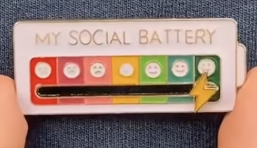

# My Social Battery

<p align="center">
  
</p>

A minimal Android home-screen widget for tracking your social battery across seven moods, from "Completely Drained" to "Fully Charged!". Drag the bolt to update; the widget mirrors your current state.

The gauge is rendered entirely on `Canvas` (neumorphic styling, no external assets), inspired by the enamel pin pictured above.

## Requirements

- Android Studio Hedgehog (or newer)
- Android SDK 34
- JDK 17 (bundled with recent Android Studio)
- Device or emulator running Android 8.0 (API 26) or higher

## Build and install

```sh
./gradlew assembleDebug
adb install app/build/outputs/apk/debug/app-debug.apk
```

Then long-press the home screen → *Widgets* → *My Social Battery* and drag it onto your layout.

## Release signing

The signing keystore is **not** checked into this repository. To produce a signed release build, create `keystore.properties` at the repo root (it is `.gitignore`d) with:

```properties
storeFile=/absolute/path/to/mysocialbattery.keystore
storePassword=...
keyAlias=...
keyPassword=...
```

Then:

```sh
./gradlew assembleRelease
```

Without that file, release builds are unsigned.

## Project layout

```
app/src/main/
├── java/com/mysocialbattery/
│   ├── activity/MainActivity.kt              # Main screen with draggable gauge
│   └── widget/
│       ├── SocialBatteryWidgetProvider.kt    # Home-screen widget provider
│       └── SocialBatteryGaugeView.kt         # Custom Canvas-drawn gauge view
└── res/
    ├── layout/           # activity_main, widget_social_battery
    ├── drawable/         # widget_background, adaptive icon foreground
    ├── values/           # strings, colors, theme
    └── xml/              # app-widget provider metadata
```

State (mood index, indicator position) is persisted in `SharedPreferences` (`social_battery_prefs`).

## License

[MIT](LICENSE)
